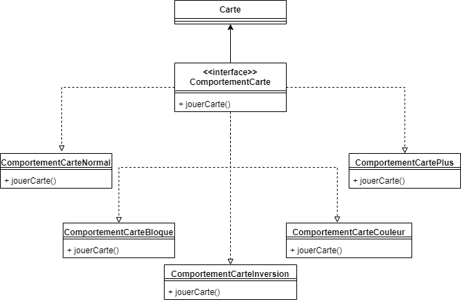
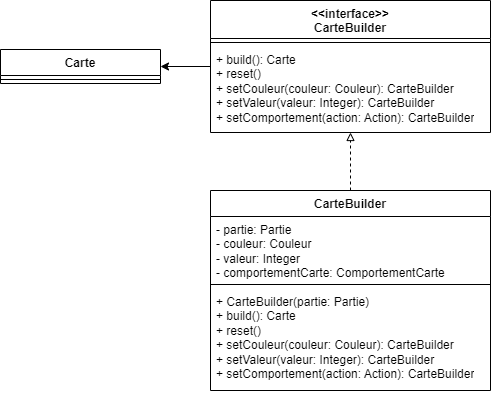
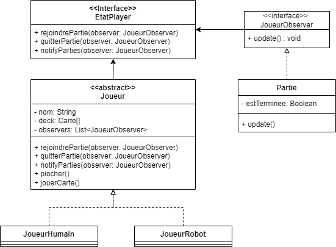

# Uno-DesignPattern

##### AUGER-DUBOIS Benoît - MENANTEAU Melvin
SDK 17

## Design Patterns utilisés

L'objectif de ce TP est de créer un jeu vidéo en ayant implémenté au moins trois design patterns différents.
L'interface n'étant pas l'objectif principal, l'interaction ce fait via CLI.

Pour jouer, il est nécessaire de renseigner un nombre de joueurs.
  Il n'y aura qu'un seul joueur humain, les autres joueurs seront des robots, jouant la première carte possible dans leur main.

Un joueur gagne lorsqu'il n'a plus de cartes en main.

### Strategy

Change le comportement de la carte lorsqu'elle est jouée.

### Builder

Crée et une retourne une carte avec la configuration souhaitée.
  Il est uniquement possible de choisir la couleur, la valeur et le comportement (ex: carte normale, carte +2)

### Observer

Permet au joueur de notifier la partie qu'il n'a plus de cartes et qu'il a donc gagné.

